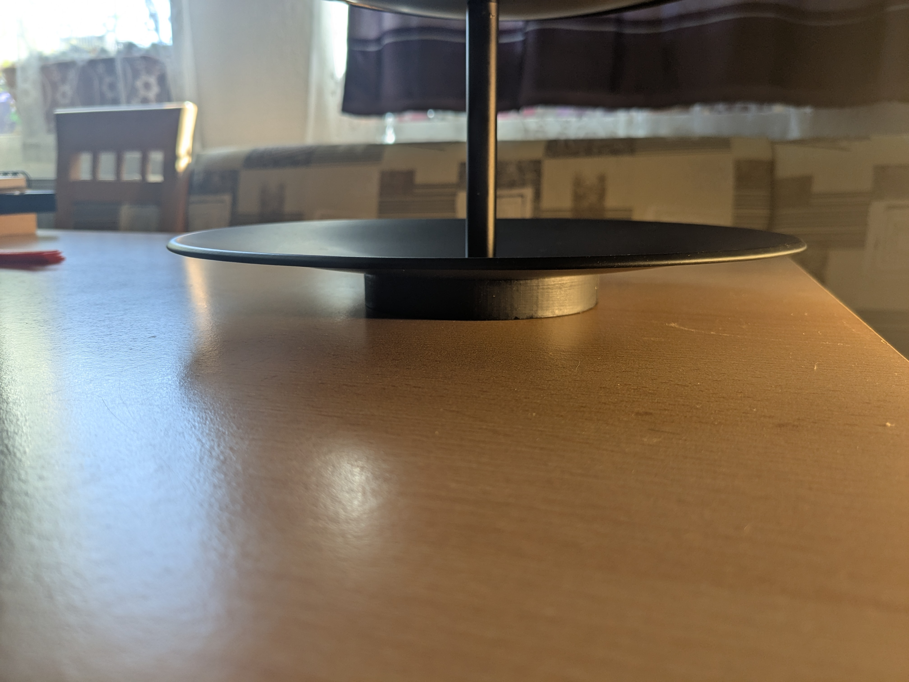
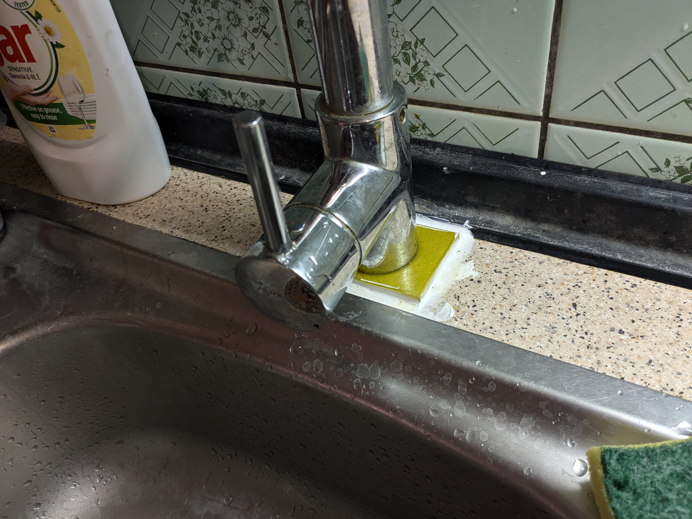
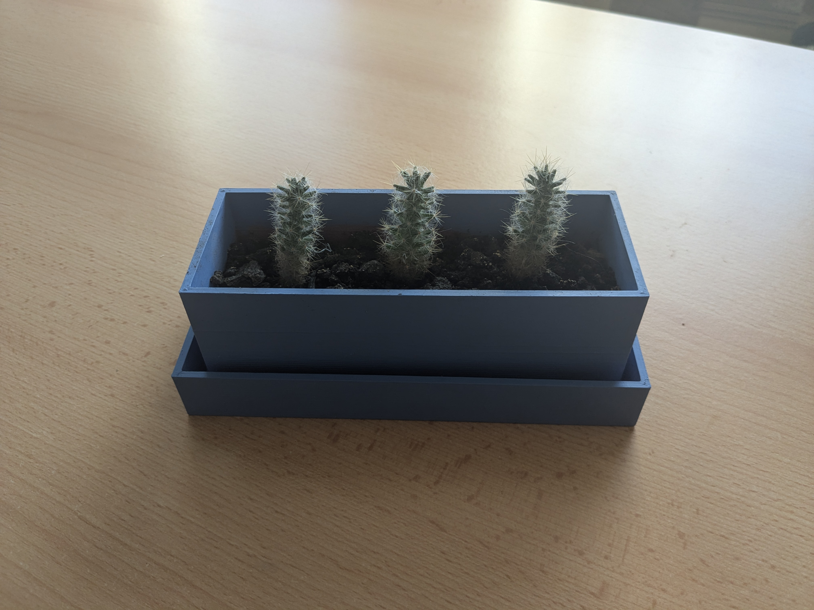
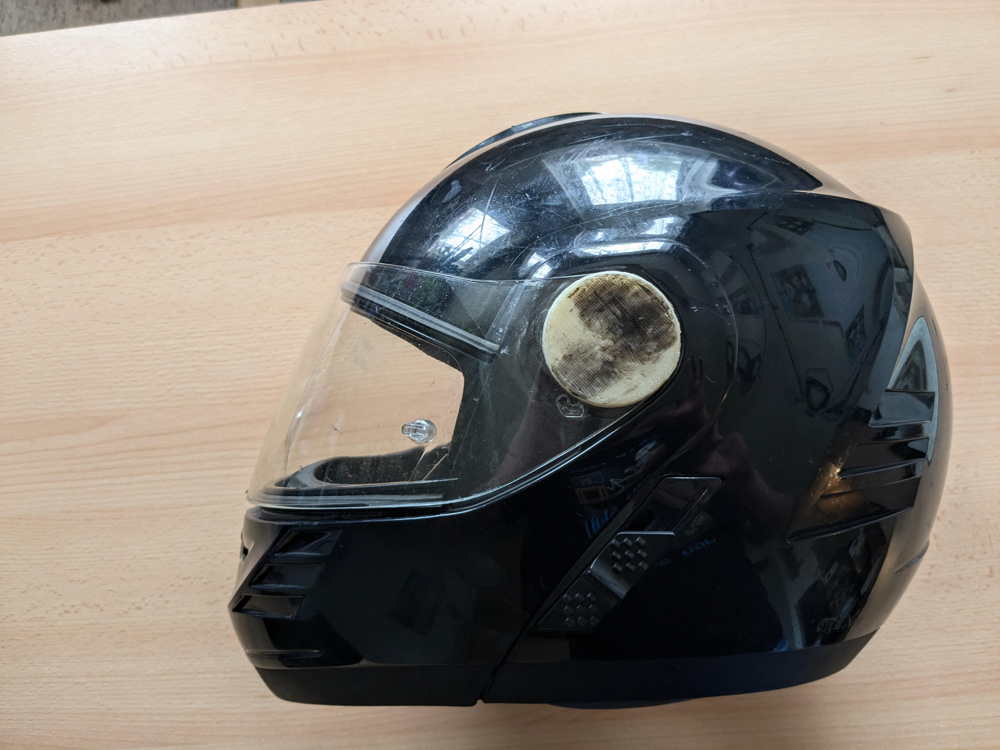
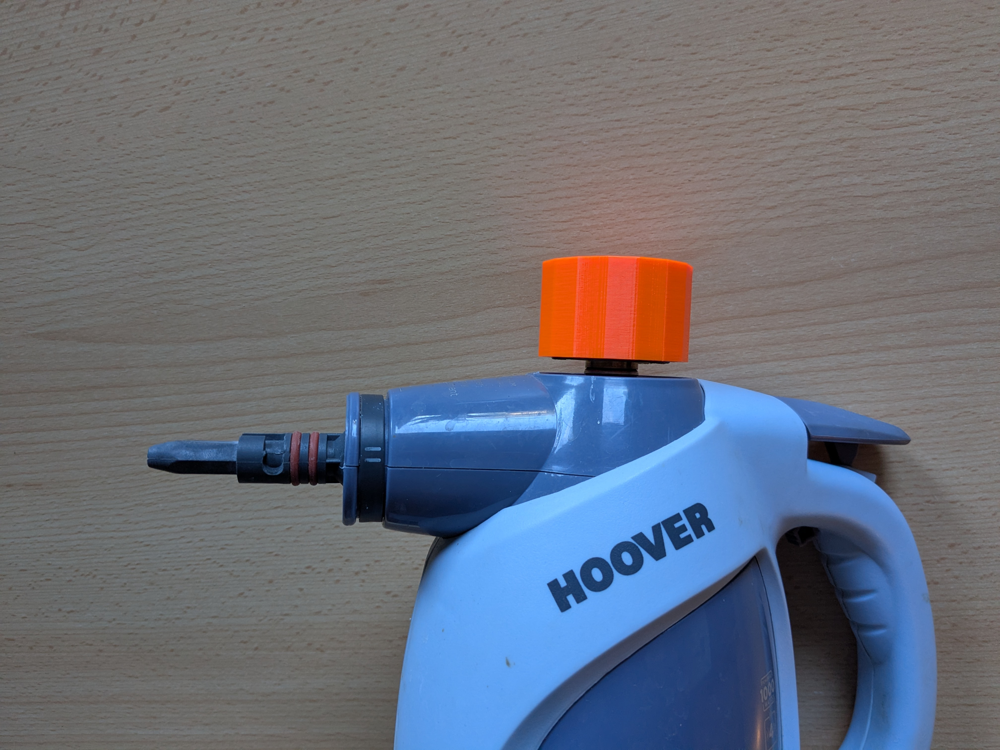
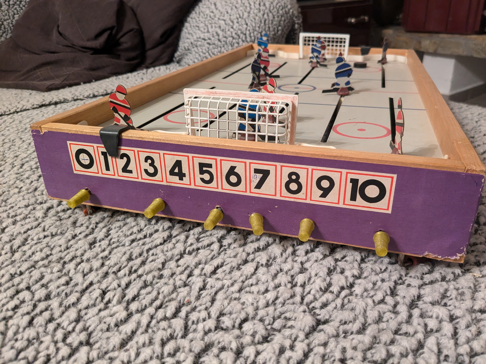
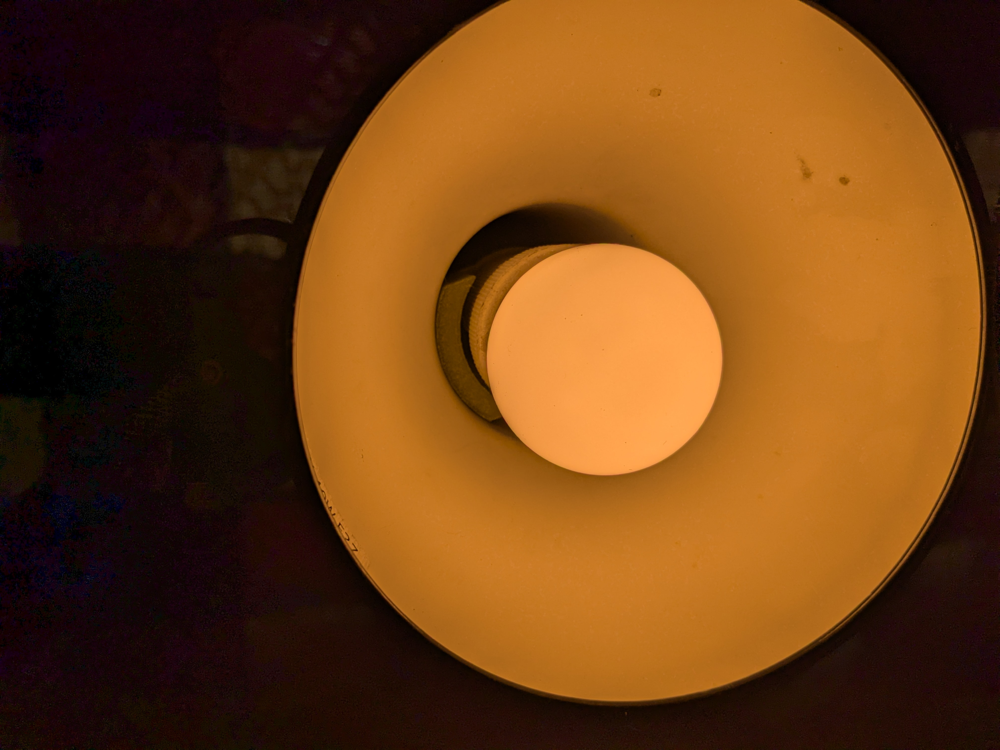
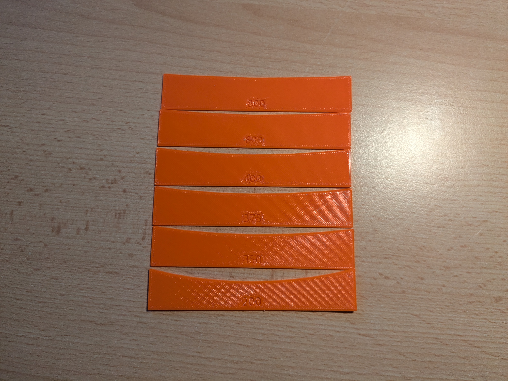
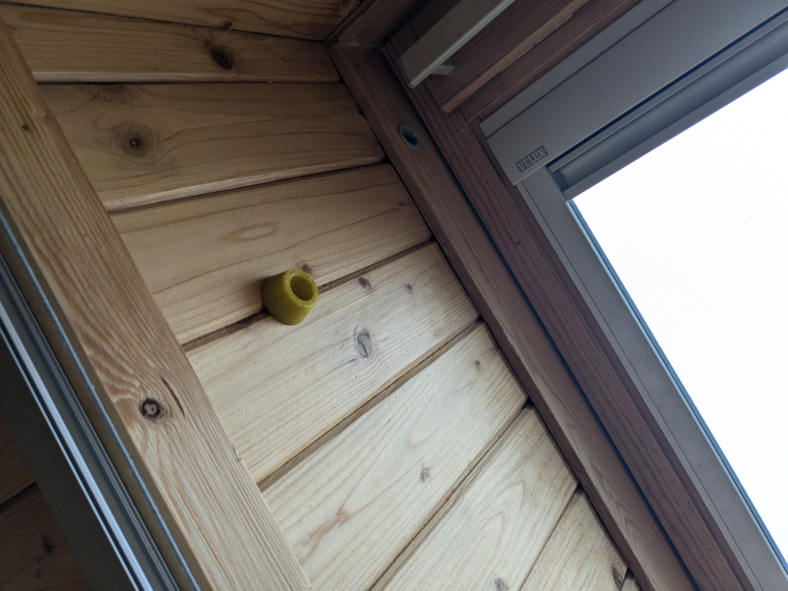

# 3d-print

This repository is collection of printable objects on my prusa printer. Some of the objects are forked from other people (you can see details inside LICENSE file).

## [Cleaver handle](./cleaver_handle.scad)

An old cleaver that was missing a handle.

## [Door knob](./doorknob.scad)

It started as a replacement for a door handle so that our dog couldn't open the door leading to the outside/inside (as she never closed the door after going through), but was later used for many other doors inside.

## [Drawer handle](./drawer_handle.scad)

Replacement for broken handles on an older table.

## [Etager stand](./etager_stand.scad)

Replacement for missing etager stand.

## [Faucet adapter](./faucet_adapter.scad)

Since the wood around the faucet got a bit rotten, the faucet was sinking into the wood. Therefore, I've created this adapter, under which I placed a bit of rubber from old car medkit to prevent slipping and sealed it with sanitary silicone to prevent water getting under the adapter.

## [Flowerpot](./flowerpot.scad)

## [Helmet nut](./helmet_nut.scad)

I've lost the original nut somewhere, so I printed new one.

## [Hoover SteamJet lid](./hoover_steamjet_lid.scad)

Old lid was cut in half as it was impossible to open, so new one was created.

## [Igra hockey knob](./igra_hockey__knob.scad)

Old knobs were cracked and couldn't grip the rods anymore. These new ones work great and have better grip with fingers.

## [Knife handle](./knife_handle.scad)

Long time ago I received an old knife with handle made of some animal paw (deer?). But that broke off, so I was left with knife without handle.

Image of similar knife I found on the internet: https://www.uton.cz/nuz-csla-vo-7/vo7-foto/

## [Lamp bulb holder](./lamp_bulb_holder.scad)

Replacement for broken bulb holder.

## [Radius gauge](./radius_gauge.scad)

Gauges for radius measurement.

## [Somfy gear](./somfy_gear.scad)

Original gear broke after guarantee. Model: [ELIXO 500 3S RTS](https://www.somfy.cz/products/1216364/elixo-500-3s-rts).

## [Window stopper](./window_stopper.scad)

